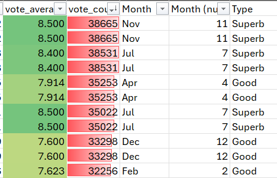

# Week 1 Workbook Summary

## Day 1: Laws and Regulations
On Day 1, we looked up the laws and regulations that govern customer data. These are vital for Data Analysts to ensure data is handled legally and to avoid legal repercussions.

* **Data Protection Act:** Regulates the use of personal information and grants individuals the right to access data held about them.
* **GDPR (General Data Protection Regulation):** A UK and EU law controlling how organizations collect, store, and use data, providing individuals rights over the correction and deletion of their information.
* **Freedom of Information Act:** Grants the public the right to access recorded information held by public authorities.
* **Computer Misuse Act:** Specifically designed to protect computers against unauthorized access or illegal data modification.

---

## Day 2: Excel Fundamentals and Data Analysis
Day 2 focused on working with datasets in Excel using basic functions and visualization tools.

* **Functions Used:** `SUM`, `AVERAGE`, and `COUNT`.
* **Conditional Formatting:** Applied to an IMDb dataset to provide visual context.
    * **Color Grading:** Added to film ratings to show performance at a glance.
    * **Data Bars:** Added to the number of ratings to show sample size.
* **Key Insight:** Identifying that a lower sample size makes a rating less reliable; visual aids help readers understand this context immediately.

---

## Day 3: Pivot Tables and Macros
Day 3 focused on advanced data categorization and interpretation.

* **Tools:** Pivot Tables and Macros.
* **Dataset:** Bike sales data.
* **Process:** Categorized numerical data by splitting it into specific segments:
    * Country
    * Gender
    * Age Groups
* **Outcome:** Used Pivot Tables to answer specific business questions, such as identifying which markets were most active in particular countries.

  
## Day 4

On **Day 4**, we learned how to protect Excel sheets—from locking specific cell ranges to setting up full workbook passwords. This is a critical skill, as data security is vital for staying compliant with **Data Protection Acts**.

Finally, we held a detailed discussion on planning presentations for a **Board of Directors**. We focused on the idea that data analysis is only valuable if it can be explained clearly and persuasively to decision-makers.

> **Key Takeaway:** Analysis is useless unless it can be effectively communicated.

