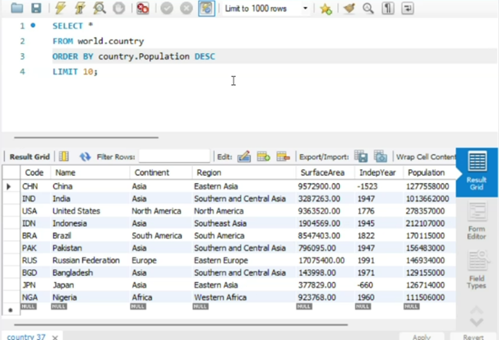

# Week 3: Basics of Databases and SQL

Week 3 saw us learn the basics of relational and non-relational databases, as well as teaching us basic SQL queries and joins. 

---

## Day 1
Day 1 taught us the basics of databases. This included the structure such as the **primary and foreign keys**. We also learnt about the problems of a **many-many relationship** and how we would require another table to deal with that issue. 

We then created our own database design, which allowed us to work through the different relationships of databases, including the relationship of foreign keys.  

Finally, we learnt about the difference between **relational** and **non-relational** databases. 

## Day Two
Day two was the most important as we learnt about **SQL (Structured Query Language)**, which was a programming language designed for the storing, manipulating and retrieving of data from relational databases. 

* **Basic Operators:** Learnt how to filter and manipulate data.
* **Aggregate Functions:** Practiced calculating data sets.
* **Group By:** Used as a pivot table tool to organize data.

At the end of this day, we felt comfortable using basic SQL queries to select data, specific rows, and creating aggregates. 

## Day Three 
Day three we started to use our tools to start more complex queries, such as:
* **Subqueries**
* **Adding more data**
* **Filtering data**

We finished the day learning about **join tables**, researching the different types and the kind of results we can expect from each one. 

## Day Four
Day four first saw us create a database design for a small business. This allowed us to show the basic understanding of relationships, ensuring we had the right **Primary Keys**. We also dealt with a many-many issue and how to fix that. 

Then we practised SQL queries on a large data set, practising:
1. Basic queries
2. Joins
3. Mathematical actions

---

> I finished this week with a strong understanding of Databases, SQL techniques and queries.

