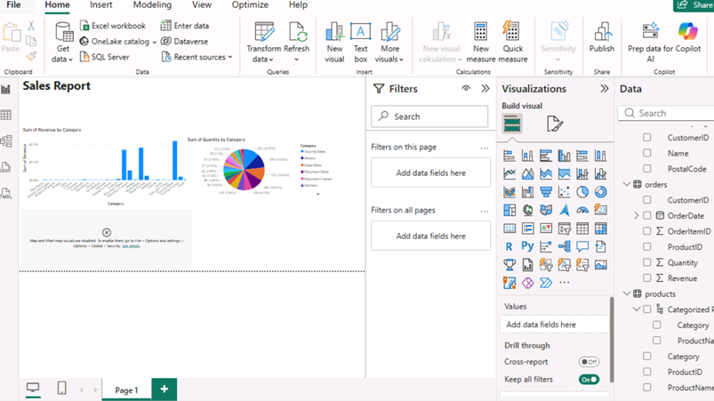

# Week 5: Azure Data Fundamentals

This week we explored **cloud computing**, analyzing its strengths and limitations. We then shifted our focus to developing practical skills within **Microsoft Azure**, one of the industry's leading cloud platforms.

---

## Day 1: Cloud Computing Essentials
We began with the foundations of cloud technology, identifying key benefits such as **cost-effectiveness**, **scalability**, and **seamless integration** with existing tools.

### Cloud Service Models
We examined the three primary service tiers:
* **IaaS (Infrastructure as a Service):** Providing the raw building blocks (servers, storage).
* **PaaS (Platform as a Service):** Providing a framework for developers to build and host applications.
* **SaaS (Software as a Service):** Delivering ready-to-use software over the internet.

### Deployment Models
We also compared the different ways clouds can be deployed:
* **Public, Private, and Community Clouds.**
* **Hybrid Cloud:** The most common choice, as it balances the accessibility of public connections with the data security of a private server.

---

## Day 2: Data Legislation & Ethics
Building on our knowledge from Week 1, we took a deep dive into the legal frameworks governing data and technology in the UK:

| Legislation | Key Focus |
| :--- | :--- |
| **Computer Misuse Act 1990** | Criminalizing unauthorized access to computer systems (hacking). |
| **Police and Justice Act 2006** | Amendments regarding cybercrime and system interference. |
| **Data Protection Act 2018** | The UK’s implementation of GDPR; protecting personal data. |
| **Consumer Rights Act 2015** | Protecting consumers in digital and physical transactions. |

> **Key Takeaway:** This session built a strong understanding of our responsibilities when handling private data and the significant legal penalties for non-compliance.

---

## Day 3: Microsoft Azure Fundamentals
Day 3 focused on the technical architecture of **Microsoft Azure**. We explored its capabilities in handling both **relational** and **non-relational** database tables. 

We also investigated large-scale analytical tools, specifically learning how to use **Databricks** for executing complex SQL queries across massive datasets.

---

## Day 4: Real-Time Analytics & Reporting
The final day focused on the flow of data from ingestion to visualization:

1.  **Azure Stream:** Used for real-time data analytics.
2.  **Power BI Integration:** We practiced connecting Azure data analysis to **Power BI** (see Workbook 2) to create interactive dashboards.
3.  **Final Project:** We developed a comprehensive analysis for a small business cloud database. This project integrated:
    * **Structure:** Applying database design skills from Week 3.
    * **Compliance:** Accounting for relevant data laws.
    * **Resilience:** Planning for security and backups.

---

## Weekly Summary
We concluded the week with a robust understanding of cloud architecture, the hands-on ability to manage data within Azure, and the skills to visualize those insights through Power BI.
